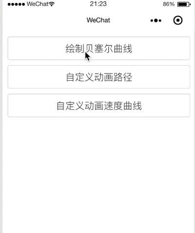
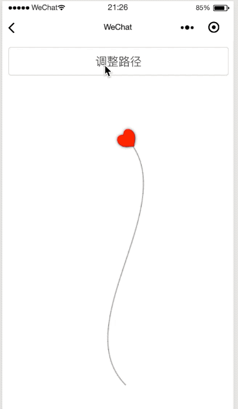
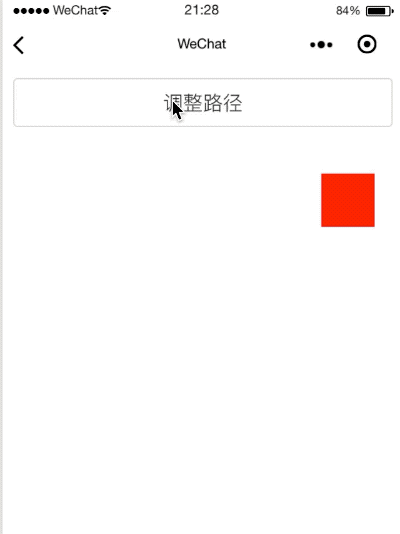
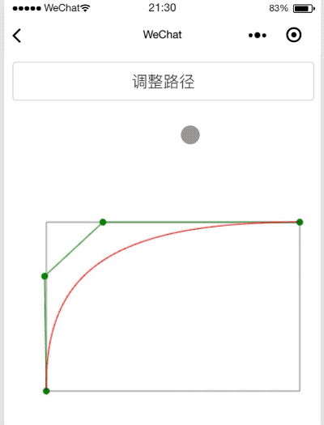
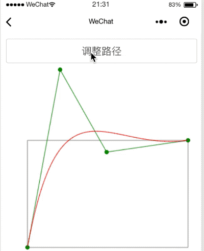

# Canvas 实现小程序动画

> 这是一篇很短的分享，很省时间。

这个 Demo 是半年前写的，直接扔了有点可惜，就拿出来分享给刚入门的同学参考。源代码没有写备注，函数名就是备注，看函数名应该能猜到我是写什么端的😂。

文中动画都是 Canvas 绘制的，这里就不贴代码了，直接看效果图，有感兴趣的想看实现的直接看源码。

## 1. 绘制贝塞尔曲线

## 2. 自定义路径动画

## 3. 自定义动画速度曲线

### 3.1 淡入淡出

### 3.2 淡出

### 3.2 弹簧

